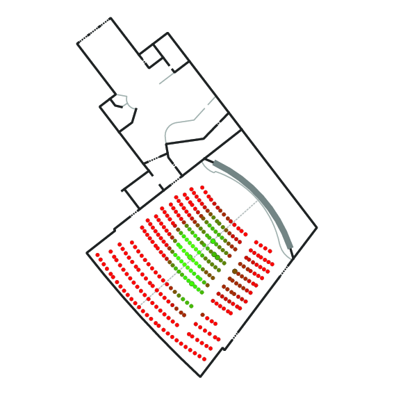

# Cinema seat ranking

Visualize the best seat in your cinema.

This example shows the Savoy Filmtheater in Hamburg, Germany, with its layout, seats and some ratings:

## Usage

### Setup

1. `python3 -m venv --system-site-packages .venv`
2. `source .venv/bin/activate`
3. `pip install click geojson geopy`

### Processing the data

1. `./process.py update-estimates --seat-map your-cinema-plan.geojson`
    * If no `--output ./path/to/file.geojson` is given, `./processed-data.geojson` will be used.

## Render as map

1. `./process.py render`
    * If no `--seat-map path/to/file.geojson` is given, `./processed-data.geojson` will be used.
    
## Create a seat map

1. Get a picture of the plan (online screenshot, website, emergency evacutation map, ...)
2. Load it into your favorite GIS tool (QGIS, JOSM, ...) and digitize it.
    * Tip: Georeference the image first so that distances between seats are realistic.
3. 

### Data model

The following attribuites can be given to features.
The `Point` features are usually the seats and the `LineString` features are things like walls.

A feature will be considered as "seat" when it's a point and the `row` attribute is set.

| Key               | Value                    | Feature type | Description |
|-------------------|--------------------------|--------------|-------------|
| `row`             | Any (`A`, `3`, etc.)     | `Point`      | The name/id of the row. |
| `seat` (optional) | Number (`3`, `12`, etc.) | `Point`      | The row number. Only used by the `validate` command of the script. |
| `rating`          | Float (0.0 - 10.0)       | `Point`      | The rating for this seat. Higher means better seat. |
| `cinema`          | `screen`                 | `LineString` | The screen of the theater. |
| `indoor`          | `view_axis`              | `LineString` | The central view axis. Seats on this line look exactly to the center of the screen. |
| `indoor`          | `wall`                   | `LineString` | A wall of the building. |
| `indoor`          | `room_divider`           | `LineString` | Some room divider, the edge of a stage, counter, etc. |
| `indoor`          | `door`                   | `LineString` | A door. |
